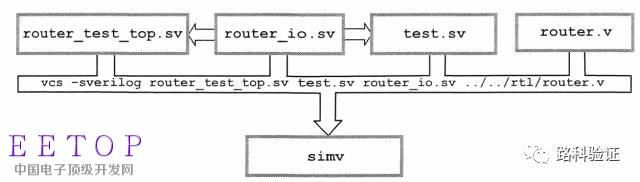

<!--
 * @Author: weiwei
 * @Date: 2022-03-30 21:19:59
 * @LastEditors: WeiWei
 * @LastEditTime: 2022-04-06 17:53:06
 * @FilePath: /notes/hardware/synopsys lab.md
 * @Description: synopsys 实验笔记
-->

# Synopsys Lab

## 构建 sv testbench


- 顶层（Top）文件，harness file：`router.test_top.sv`
- 接口(Interface)文件：`router.if.sv`
- 测试（Test）文件：`test.tb.sv`
- 待测试（DUT）文件：`router.v`

> 示例代码中分别命名为 `router_test_top.sv`,`router_io.sv`, `test.sv`, `router.v`

### Step 1. 创建Verilog test 顶层线束文件（Top harness file）

- Use VCS template generator

    ```shell
    ntb_template -t router router.v
    ```

  - 创建文件：
    - `router.test_top.v` Verilog test harness file
    - router.if.vrh Discard (for OpenVera only)
    - router.vr.tmp Discard (for OpenVera only)

  - 其中:
    - `-t router` Specifies DUT module name
    - `router.v` DUT source code file
    - `router.test_top.v` will be used to help build SystemVerilog testbench files

    - `router.v` must be the last entry in the ntb_template command.

### Step 2. 创建SV接口文件（interface file）

- 创建`router.if.sv`文件，并用编辑器打开它。
  
  ```shell
  cp router.test_top.v router.if.sv
  ```

  

    ```systemverilog
    interface router_io(input bit clock);
    logic reset_n;
    logic [15:0]  din;
    logic [15:0]  frame_n;
    logic [15:0]  valid_n;
    logic [15:0]  dout;
    logic [15:0]  valido_n;
    logic [15:0]  busy_n;
    logic [15:0]  frameo_n;
    ```

  - 上面是需要连接到DUT的信号。
  - 注意：在这一部分的所有接口都是异步且没有方向的（例如input，output，inout就是有方向）。接口的方向只能在针对同步信号的时钟模块（Clocking block）或是针对异步信号的（modport）中被说明。

- 创建同步（synchronous）信号给测试程序（test program）从而可以驱动（drive）和采样（sample）DUT中的信号
  
    ```systemverilog
    clocking cb @(posedge clock);
        default input #1ns output #1ns;
        output reset_n;
        output din;
        output frame_n;
        output valid_n;
        input  dout;
        input  valido_n;
        input  frameo_n;
        input  busy_n;
    endclocking: cb
    ```
  
  - 默认所有接口信号都是异步的（asynchronous）

  - 声明一个由时钟上升沿所驱动的时钟模块（Clocking block，以后简称CB）。
    - 这个时钟模块将会被测试程序用来实施同步驱动（drive）和采样（sample）。
    - 这个CB中的所有信号的方向（direction）必须和DUT中的信号方向一致。

    

- 说明 input/output 的 `skew`

    `default input #1ns output #1ns;`

  - `input  #1ns` 指的是采样时间相对时钟上升沿提前1ns，但不在波形上显示。用来模拟真实电路中的建立时间。  
  - `output #1ns`指的是驱动时间相对时钟上升沿推后1ns，会在波形上显示出来。用来模拟真实电路中的传播延时。

  - If unspecified, the sample and drive skew defaults to:
  
    `default input #1 output #0;`

- 创建一个`modport TB()` 连接测试程序
  
  `modport TB(clocking cb, output reset_n);`

  - 在它的参数（argument）列表中，应该引用之前创建的时钟模块CB和其它所有可能会用到的异步（asynchronous）信号。

   > 路桑的书中对Interface和modport有一个形象的比喻：interface是一整个插排，而modport就是连接各部分的插座。

- `router.if.sv` 代码
  
  ```systemverilog
  interface router_io(input bit clock);
  logic reset_n;
  logic [15:0]  din;
  logic [15:0]  frame_n;
  logic [15:0]  valid_n;
  logic [15:0]  dout;
  logic [15:0]  valido_n;
  logic [15:0]  busy_n;
  logic [15:0]  frameo_n;

  //Lab 1 - Task 2, Step 3
  //
  //Declare a clocking block driven by posedge of signal clock
  //Add all signals required to connect test program to the DUT
  //All directions must be with respect to test program
  //ToDo
  clocking cb @(posedge clock);
    default input #1ns output #1ns;
    output reset_n;
    output din;
    output frame_n;
    output valid_n;
    input  dout;
    input  valido_n;
    input  frameo_n;
    input  busy_n;
  endclocking: cb

    //Lab 1 - Task 2, Step 4
    //
    //Add input and output skew in clocking block(optional)
    //ToDo

  //Lab 1 - Task 2, Step 5
  //
  //Create a modport to connect to test program
  //Arguments should list clocking block and all other potential asynch signals
  //ToDo
  //你看这里有趣的是，modport端口同步的信号只有reset_n  而没有其他的信号，因为实验1只完成复位功能吧
  modport TB(clocking cb, output reset_n);
  endinterface: router_io

  ```

### 创建SV testbench 文件并重置（reset）Router

testbench 封装在 program block 中


- 模板

```systemverilog
// root global variables

program [automatic] name(interface);
    // `include files
    // program global variables 
    initial begin
    // local variables
    // top-level test code 
    end
    task task_name(...); 
    // local variables
    // code
    endtask
endprogram
```
  
- 引用接口模块中的`modport TB`作为参数（argument），将`interface`和`test program`连接在一起。

    ```system verilog
    program automatic test(router_io.TB rtr_io);
    ```

- 在初始化模块中（initial begin），使用`$vcdpluson`来创建一个`vcd+dump`文件来产生可见波形。
  
  ```system verilog
  $vcdpluson;
  ```

- 在这个程序（program）模块中，定义一个任务（Task）：`Reset()`，实现`重置DUT`的功能。

    

    

    ```systemverilog
    task reset();
        router.reset_n = 1'b0;
        router.cb.frame_n <= '1;
        router.cb.valid_n <= '1;
        ##2 router.cb.reset_n <= 1'b1;
        repeat(15) @(router.cb);
    endtask: reset
    ```

  - `reset_n`既可以是同步信号也可以是异步信号

  - 驱动同步信号（syn），要用非阻塞赋值(non-blocking assignment)

    `[##num] interface.cb.signal <= <value> or <variable expression>;`

    

  - Sampling Synchronous Device Signals
  
    `variable = interface.cb.signal;`

    - No delay attribute (## num)
    - Variable is assigned the sampled value
    - Sampling of output signal is not allowed

    ```systemverilog
    data[i] = router.cb.dout[7];
    all_data = router.cb.dout;
    @(posedge router.cb.frameo_n[7]); 
    $display(“router.cb.din = %b\n”, router.din); //error 
    if(router.cb.din[3] == 1’b0) //error
    ```

  - Advancing Simulation Time
    - Asynchronous
      - (Verilog coding style)

    ``` systemverilog
    #delay;
    @(negedge interface.signal);
    ```

  - Synchronous (advancing clock cycles):
    - Verilog coding style:

    `@(posedge interface.clock_signal);`

    `repeat (10) @(posedge interface.clock_signal);`

  - SystemVerilog coding style (clocking block):
`@(interface.clocking_block);`
`repeat (10) @(interface.clocking_block);`

  - Each clocking block specifies a clock signal and edge:

    ``` systemverilog
    interface router_io(input logic clock);
    clocking cb @(posedge clock);
    ...
    endclocking
    endinterface
    ```

  - 为了让事件触发生效 `@(posedge interface.clock_signal);` 在 `router.if.sv` 文件中,`clock_signal`必须作为一个额外的异步信号做modport的传参:

    `modport TB(clocking cb, output reset_n, input clock);`

- `test.tb.sv` 代码

  ```systemverilog
    //Lab 1 - Task 3, Step 2
    //
    //Declare a program block with arguments to connect
    //to modport TB declared in interface
    //ToDo
    program automatic test(router_io.TB rtr_io);

    //Lab 1 - Task 3, Step 3
    //
    //Declare an initial block 
    //In the initial block print a simple message to the screen
    //ToDo
    initial begin
        $vcdpluson;
        reset();
    end

    //Lab 1 - Task 6, Steps 3 and 4 -
    //
    //Replace $display() in initial block with $vcdpluson
    //Call reset() task
    //ToDo - Caution!! Do only in Task 6

    //Lab 1 - Task 6, Step 2
    //
    //Define a task called reset() inside the program to reset DUT per spec.
    //ToDo - Caution!! Do only in Task 6
    task reset();
    rtr_io.reset_n = 1'b0;
    rtr_io.cb.frame_n <= '1;
    rtr_io.cb.valid_n <= '1;
    ##2 rtr_io.cb.reset_n <= 1'b1;
    repeat(15) @(rtr_io.cb);
    endtask: reset

    endprogram: test

  ```

### 创建SV测试的 TOP 文件 (top-level Harness File)


- 如果DUT模块已经由SystemVerilog if 文件构建,连接可以简化为:

  `router dut(top_io);`

### 用VCS 编译（Compile） RTL & 模拟（Simulate）

各个文件代表的组件：


- Compile HDL code: (generate simv simulation binary) VCS将编译这些文件并产生`simv` 执行文件。



   > vcs –sverilog [-debug] router.test_top.sv \router.tb.sv router.if.sv router.v

- `-sverilog` Enable SystemVerilog constructs
- `-debug` Enabledebugexceptlinestepping
- `-debug_all` Enable debug including line stepping

- Get vcs compiler switch summary:
  > vcs -help

- Simulate DUT with SystemVerilog testbench: (running simv) 对VCS产生的执行文件进行跑仿真。
  > ./simv

  - `-l` logfile Create log file
  - `-gui` RunGUI
  - `-ucli` Run with new command line debugger
  - `-i` cmd.key Execute UCLI commands

- 使用DVE来观察相关波形。
  >dve&

- sv 运行选项
  
  sv tb 运行时可以传参

  - 提取参数 `$value$plusargs()`

  ```systemverilog
  initial begin
    int user_seed;
    if ($value$plusargs("ntb_random_seed=%d", user_seed))
        $display(“User seed is %d", user_seed);
    else
        $display(“Using default seed");
    end
  ```

  - 带传参运行tb 仿真器
    > ./simv +ntb_random_seed=100

## DUT 信号驱动和采样 (Driving & sampling)

DUT 信号由testbench中的 driver 驱动，由 monitor 采样


程序代码的同步驱动和采样是 Cycle-based 的，Events 发生在interface的 clock-block 的时钟边沿


### SystemVerilog Scheduling


### 信号驱动 driving

> `[##num] interface.cb.signal <= [##num] <value | expression>;`

- 一定是非阻塞赋值
- `##num` 延迟多少个时钟
- 不允许驱动输入信号

- 举例：

    `##1 router.cb.din[3] <= var_a;`

    

- 错误示例：

    ```systemverilog
        router.cb.din[3]   = 1’b1; // error
    ##1 router.cb.dout[3] <= 1’b1; // error
    ##2 router.din[3]     <= 1’b1; // error
    ```

- 错误1: 使用阻塞赋值
  - `router.cb.din[3] <= 1’b1;`
- 错误2: 使用驱动了输入信号
- 错误3 没用通过 clocking block 驱动
  - `##2 router.cb.din[3] <= 1’b1;`

#### 时钟延迟

`##2 router.cb.din <= var_a; next_statement;` is similar to:
`#2 router.cb.din <= var_a; next_statement;`

In that, time advances first, var_a is then evaluated, the assignment is scheduled for the non-blocking region (+output delay) and next_statement is executed.

`router.cb.din <= ##2 var_a; next_statement;` is similar to:
`router.cb.din <= #2 var_a; next_statement;`

In that, var_a is evaluated immediate, the assignment is scheduled for the second valid clock edge from now (+output delay) and next_statement is executed without time advancing.

- 举例

    ```systemverilog
    ##1 router.cb.din[3] <= 1;
    var_a = var_b;
    ##3 router.cb.din[3] <= var_b;
    ```

    

### 信号采样

> `variable = interface.cb.signal;`

- 没有时钟延迟（## num）
- 变量 variable 由 clocking block 的信号赋值
- 不能采样输出信号

- 举例

```systemverilog
   data[i]  = router.cb.dout[7];
   all_data = router.cb.dout;

   @(negedge router.frameo_n[7]); //error
   $display(“din = %b\n”, router.cb.din); //error
   if(router.cb.din[3] == 1’b0) begin ... end  //error
```

#### 信号同步 synchronization

- 与clocking block 的时钟边沿同步

  ```systemverilog
    @(router.cb); // continue on next clock edge specified in cb
    repeat (3) @(router.cb); // Wait for 3 cb clock cycles
  ```

- 与任何信号边沿同步

  ```systemverilog
    @(router.cb.frameo_n[7]); // continue on any edge
    @(posedge router.cb.frameo_n[7]); // continue on posedge
    @(negedge router.cb.frameo_n[7]); // continue on negedge
    wait (router.cb.valido_n==0);     // wait for expression
                                // no delay if already true
  ```

- 示例

On what edge is the following detected?

> `@(negedge router.cb.frameo_n[7]);`


下边沿会在 边沿D 检测到而不是C.

D是观察DUT输出时需要监视器事务处理程序处于的边缘。时钟边缘D处的监控例程充当时钟边缘C发出的信号的捕获触发器。

- 示例2
  
  时序图

  ```systemverilog
    initial begin
        router.reset_n <= 0;
        #100 router.cb.reset_n <= 1;
        router.cb.frame_n <= ’1;
        router.cb.valid_n <= ##3 ’1;
        ##2 router.cb.frame_n <= ’0;
        repeat(3) @(router.cb);
    end
  ```

    

    非阻塞赋值不会提前下一行的时间。

    ##0表示当前模拟时间，##1表示下一个有效时钟边缘。

    在这两种情况下，同步信号只能在有效的时钟边缘+有效的output skew 下驱动。
